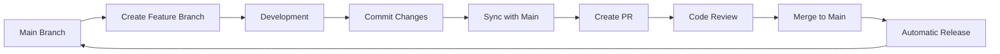

# Development Workflow

This document describes the standard development workflow for net-monitor.

## Workflow Overview



## Step-by-Step Process

### 1. Start New Feature

```bash
# Ensure you're on main and up to date
git checkout main
git pull origin main

# Create feature branch
git checkout -b feature/your-feature-name
# OR use Claude command: "Create a feature branch for [description]"
```

### 2. Development

Write your code following project conventions:
- Follow Rust idioms and best practices
- Maintain consistent code style
- Add tests for new functionality
- Update documentation as needed

### 3. Commit Changes

Use conventional commits for all changes:

```bash
# Stage changes
git add .

# Create conventional commit
git commit -m "feat: add new monitoring metric"
# OR use Claude command: "Commit my changes"
```

Commit types:
- `feat`: New feature
- `fix`: Bug fix
- `docs`: Documentation only
- `style`: Formatting, no code change
- `refactor`: Code restructuring
- `perf`: Performance improvement
- `test`: Adding tests
- `chore`: Maintenance

### 4. Keep Branch Updated

Regularly sync with main to avoid conflicts:

```bash
# Fetch latest changes
git fetch origin main

# Merge main into your branch
git merge origin/main
# OR use Claude command: "Sync with main"
```

### 5. Pre-PR Checklist

Before creating a PR, ensure:

- [ ] All tests pass: `cargo test`
- [ ] Code compiles without warnings: `cargo build`
- [ ] Code is formatted: `cargo fmt`
- [ ] Linting passes: `cargo clippy`
- [ ] Documentation is updated
- [ ] Commit messages follow convention

### 6. Create Pull Request

```bash
# Push your branch
git push -u origin feature/your-feature-name

# Create PR via GitHub CLI
gh pr create --title "feat: your feature" --body "Description"
# OR use Claude command: "Prepare a PR"
```

PR should include:
- Clear title following commit convention
- Description of changes
- Testing performed
- Screenshots if UI changes
- Related issue references

### 7. Code Review Process

#### For Authors:
- Respond to all feedback
- Make requested changes
- Re-request review when ready
- Keep PR updated with main

#### For Reviewers:
- Check code quality and style
- Verify tests are adequate
- Ensure documentation is updated
- Test functionality locally if needed

### 8. Merging

Once approved:
1. Ensure branch is up to date with main
2. All CI checks pass
3. Squash and merge (preferred) or merge commit
4. Delete feature branch after merge

### 9. Release Process

Releases are automated based on commits:

- Breaking changes → Major version bump
- Features → Minor version bump  
- Fixes → Patch version bump

The release workflow:
1. Detects version bump needed
2. Updates version in Cargo.toml
3. Creates git tag
4. Builds binaries for all platforms
5. Creates GitHub release with changelog

## Branch Naming Conventions

- `feature/` - New features
- `fix/` - Bug fixes
- `docs/` - Documentation updates
- `chore/` - Maintenance tasks
- `refactor/` - Code refactoring

Examples:
- `feature/email-notifications`
- `fix/connection-timeout`
- `docs/update-readme`
- `chore/update-dependencies`

## Commit Message Examples

### Good Examples

```
feat(monitor): add retry logic for failed connections

Implements exponential backoff for connection retries
to improve reliability during network issues.

Closes #123
```

```
fix(database): prevent connection pool exhaustion

Ensures connections are properly released even when
errors occur during query execution.
```

```
docs: update installation instructions for macOS
```

### Bad Examples

```
Fixed bug          # Too vague
Update code        # No context
WIP               # Don't commit WIP
various changes   # Be specific
```

## Emergency Hotfix Process

For critical production issues:

1. Create branch from main: `fix/critical-issue`
2. Make minimal fix
3. Test thoroughly
4. Create PR with `[HOTFIX]` prefix
5. Get expedited review
6. Merge immediately
7. Verify fix in production

## Tips for Success

### Do:
- Commit early and often
- Write descriptive commit messages
- Keep PRs focused and small
- Test your changes thoroughly
- Document complex logic
- Ask for help when stuck

### Don't:
- Commit directly to main
- Mix unrelated changes in one PR
- Leave TODO comments without tickets
- Ignore CI failures
- Skip documentation updates
- Merge without review

## Useful Git Commands

```bash
# View recent commits
git log --oneline -10

# Check what changed
git diff

# Undo last commit (keep changes)
git reset --soft HEAD~1

# Update commit message
git commit --amend

# Interactive rebase (clean history)
git rebase -i HEAD~3

# Stash changes temporarily
git stash
git stash pop
```

## Claude Commands Available

- **Create Feature Branch**: Start new feature development
- **Commit Feature**: Create conventional commit
- **Sync Main**: Update branch with latest main
- **Prepare PR**: Generate PR with changelog
- **Release**: Trigger new version release

See `.claude/commands/` for detailed documentation.

## Getting Help

- Check existing issues on GitHub
- Review this documentation
- Ask in PR comments
- Use Claude commands for automation
- Consult Rust documentation